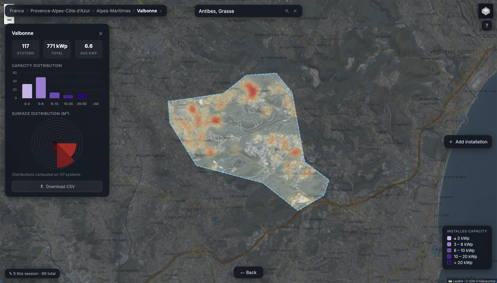

# DeepPVMapper

[](LICENSE)
[](https://huggingface.co/gabrielkasmi/bdappv-models)
[](https://huggingface.co/datasets/gabrielkasmi/bdappv)
[](https://huggingface.co/spaces/gabrielkasmi/deeppvmapper)
[](https://doi.org/10.5281/zenodo.19188878)

Large-scale rooftop PV detection pipeline for France. Classifies IGN aerial tiles with InceptionV3, segments positive patches with FCN/DeepLab, and extracts panel characteristics (surface, tilt, azimuth, installed capacity) via [pypvroof](https://pypi.org/project/pypvroof/).

**[🗺️ Explore the map and results →](https://gabrielkasmi.github.io/deeppvmapper)**  
**[🎮 Try the interactive demo →](https://huggingface.co/spaces/gabrielkasmi/deeppvmapper)**

Work carried out by [Gabriel Kasmi](https://gabrielkasmi.github.io) as part of his PhD at Mines Paris-PSL (2020–2024).



---

## Mapping data

Pre-computed detection results for French departments are available on Zenodo:

[](https://doi.org/10.5281/zenodo.19188878)

---

## Installation

GDAL must be installed system-wide first, then via pip to match the running Python version:

```bash
# Ubuntu/Debian
apt-get install -y gdal-bin libgdal-dev libopenjp2-7

pip install "GDAL==$(gdal-config --version)"
pip install -r requirements.txt
```

GPU required. CUDA 11.8+, 8 GB VRAM minimum.

---

## Data and model weights

Download model weights and runtime data from Zenodo:

[](https://doi.org/10.5281/zenodo.7576814)

Model weights are also available on Hugging Face:

[](https://huggingface.co/gabrielkasmi/bdappv-models)

The training dataset (BDAPPV):

[](https://huggingface.co/datasets/gabrielkasmi/bdappv)

Fill in the source paths in `config.yml` before running:

| config key | what goes there |
|---|---|
| `source_images_dir` | IGN JP2 tiles + `dalles.shp` index shapefile |
| `source_topo_dir` | BDTOPO folder (BATIMENT.shp, ZONE_D_ACTIVITE_OU_D_INTERET.shp) |
| `source_commune_dir` | folder containing `communes-20210101.shp` |
| `model_dir` | folder containing `model_bdappv_cls.pth` and `model_bdappv_seg.pth` |

---

## Usage

```bash
python main.py --dpt 06
```

`--count` sets tiles per classification batch (default 16 — reduce if OOM):

```bash
python main.py --dpt 06 --count 8
```

`--config` points to an alternative config file (useful for RunPod deployments):

```bash
python main.py --dpt 06 --config /workspace/config_runpod.yml
```

To process a subset of tiles (local testing), set `tiles_list` in `config.yml`:

```yaml
tiles_list:
  - 01-2024-0850-6565-LA93-0M20-E080
  - 01-2024-0850-6570-LA93-0M20-E080
```

Force a full rerun (wipe prior progress):

```bash
python main.py --dpt 06 --clean
```

---

## Pipeline

Four steps run sequentially inside `main.py`:

| step | what happens |
|---|---|
| **Init** | Builds per-department auxiliary files (buildings, plants, communes) into `temp/`. Skipped if already present — safe to rerun after a crash. |
| **Classification** | Tiles loaded fully in memory. InceptionV3 classifies 299×299 patches; positives saved as GeoTIFFs to `temp/segmentation/`. |
| **Segmentation** | FCN/DeepLab segments each positive patch. LAMB93 polygons extracted, sorted by tile, merged into pseudo-arrays. |
| **Aggregation** | pypvroof extracts tilt/azimuth/kWp per polygon. Building filter applied. Results written to `outputs_dir`. |

**On success**: `temp/` is deleted automatically.  
**On crash**: `temp/` is kept. Rerun the same command to resume from where it stopped.

---

## Outputs

Written to `outputs_dir` (default: `data/`):

| file | description |
|---|---|
| `arrays_{dpt}.geojson` | Detected PV polygons in WGS84 |
| `characteristics_{dpt}.csv` | Per-installation registry: surface (m²), tilt (°), azimuth (°), kWp, city code, lat, lon |
| `aggregated_characteristics_{dpt}.csv` | City-level aggregation: count, total kWp, avg surface, avg kWp |
| `arrays_characteristics_{dpt}.geojson` | Polygons enriched with all characteristics |

Only residential-scale installations (1.7–36.1 kWp) located on buildings are retained.

---

## Configuration reference

| parameter | default | description |
|---|---|---|
| `temp_dir` | `temp` | Working directory. Deleted on success, kept on crash. |
| `outputs_dir` | `data` | Final outputs directory. |
| `cls_threshold` | 0.4 | Classification confidence threshold |
| `cls_batch_size` | 512 | Patches per GPU batch (classification) |
| `decode_workers` | 3 | Concurrent JP2 decode processes feeding the GPU — tune to your real CPU quota, not host core count |
| `seg_threshold` | 0.46 | Segmentation binarization threshold |
| `seg_batch_size` | 64 | Images per GPU batch (segmentation) |
| `filter_building` | True | Discard detections not on a building |
| `tilt_method` | `lut` | pypvroof tilt method (`lut` or `constant`) |
| `azimuth_method` | `bounding-box` | pypvroof azimuth method |
| `ic_method` | `clustered` | pypvroof installed-capacity regression type |
| `tiles_list` | *(empty)* | Optional tile subset for partial runs |

---

## Contributing

Contributions are welcome — both **code** (performance, new imagery sources, models, building filters) and **registry corrections** via the [interactive map](https://gabrielkasmi.github.io/deeppvmapper/content/map.html), no coding required.

See [CONTRIBUTING.md](CONTRIBUTING.md) for the contribution areas, setup instructions and workflow. Issues labelled [`good first issue`](https://github.com/gabrielkasmi/deeppvmapper/issues?q=is%3Aissue+is%3Aopen+label%3A%22good+first+issue%22) are the best entry points.

---

## Known issues

**GDAL is fragile to install, for two distinct reasons — and the fix below handles both.**

1. The pip `GDAL` binding must match the system `libgdal` version exactly. `pip install GDAL` fails to build, or segfaults at import, if its version differs from the system library.
2. On images that ship a pre-installed `python3-gdal` apt package (common on RunPod/cloud GPU images), that package bundles its own `osgeo/`, which takes priority over the pip-installed one in `sys.path` — and its `.so` is often broken, regardless of what pip installs.

Run this in place of a plain `pip install`, e.g. right when deploying the pipeline, around the `pip install -r requirements.txt` step:

```bash
#!/usr/bin/env bash
set -e

# --- native GDAL lib (gdal-config must exist before pip can build the python binding) ---
apt-get update
apt-get install -y --no-install-recommends gdal-bin libgdal-dev

# --- purge python3-gdal if present: this apt package ships its own osgeo/,
#     which takes priority over the pip-installed one in sys.path, and its
#     .so is often broken ---
dpkg -l | grep -q python3-gdal && apt-get remove --purge -y python3-gdal || true
rm -rf /usr/lib/python3/dist-packages/osgeo

# --- python deps ---
pip install -r requirements.txt

# --- repin the pip GDAL binding to exactly match the native lib version
#     (requirements.txt only pins GDAL>=3.0, so pip can grab a newer
#     version than the one apt just installed -> ABI mismatch at import) ---
GDAL_VERSION=$(gdal-config --version)
pip install --no-cache-dir --force-reinstall "GDAL==${GDAL_VERSION}"

# --- check ---
python -c "
import torch
from osgeo import gdal
print('torch', torch.__version__, '| cuda', torch.cuda.is_available())
print('gdal', gdal.__version__, '| GTiff driver:', gdal.GetDriverByName('GTiff') is not None)
"
```

---

## Citation

```bibtex
@phdthesis{kasmi2024enhancing,
  title={Enhancing the Reliability of Deep Learning Models to Improve the Observability of French Rooftop Photovoltaic Installations},
  author={Kasmi, Gabriel},
  year={2024},
  school={Universit{\'e} Paris sciences et lettres}
}
```

---

## License

[MIT](LICENSE)
